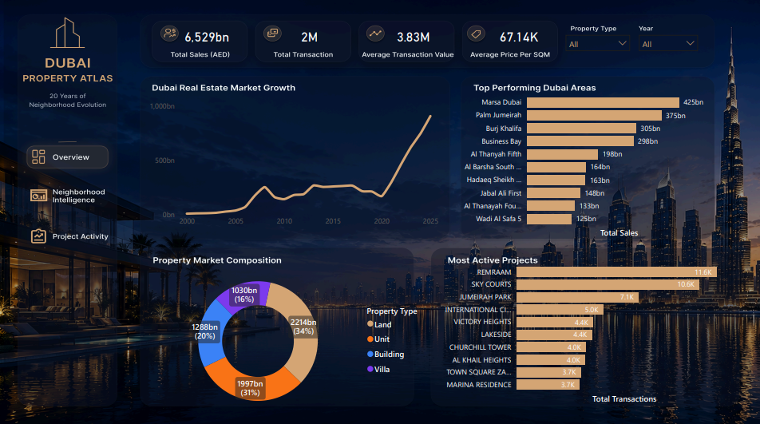
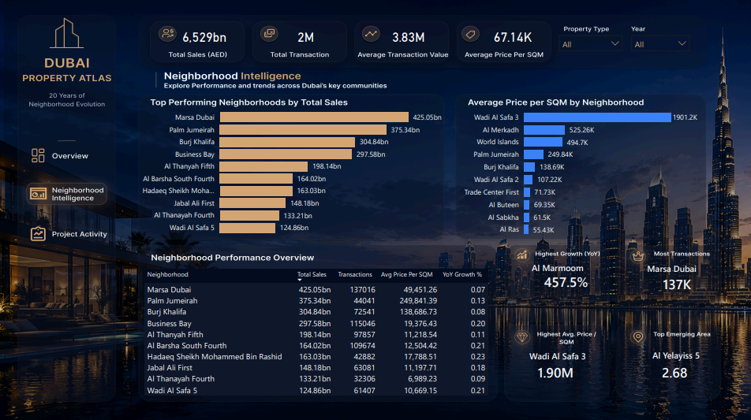
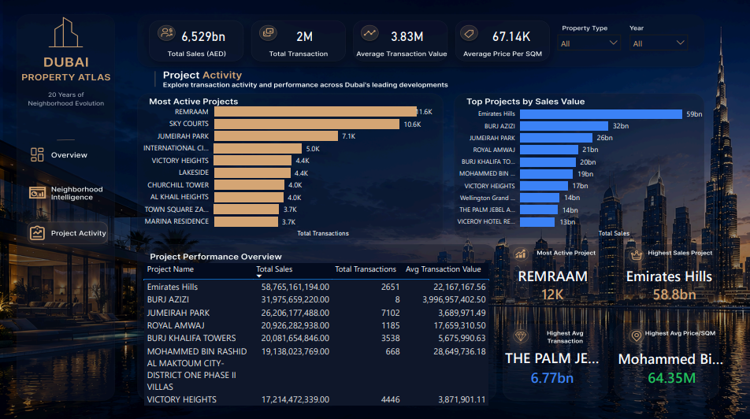

# Dubai Property Atlas: 20 Years of Neighborhood Evolution

End-to-end real estate analytics project on **1,708,561 Dubai property transactions**, from raw Dubai Land Department open data through SQL Server ETL, dimensional modeling, and an interactive Power BI dashboard.

## Dashboard

### Market Overview



### Neighborhood Intelligence



### Project Activity



---

## Tech Stack

`SQL Server` · `Power BI Desktop` · `DAX` · `Power Query` · `Star Schema Modeling` · `Figma`

---

## Headline Numbers

| Metric | Value |
|----------|----------|
| Total Transactions | **1,708,561** |
| Total Sales Value | **AED 6.53 Trillion** |
| Average Transaction Value | **AED 3.83 Million** |
| Average Price per SQM | **AED 67.14K** |
| Time Span | **2004 → 2025** |
| Dashboard Pages | **3** |

---

## Architecture

```text
Dubai Land Department Open Data
                │
                ▼
      Raw_Transactions_Stage
                │
                ▼
      Raw_Transactions_Typed
                │
                ▼
         Star Schema
 ┌──────────┬──────────┬─────────────┬──────────────────┐
 │ Dim_Date │ Dim_Area │ Dim_Project │ Dim_Property_Type│
 └────┬─────┴────┬─────┴──────┬──────┴─────────┬────────┘
      │          │            │                │
      └──────────┴────────────┴────────────────┘
                          ▼
                    Fact_Sales
                 (1.7M+ Records)
                          │
                          ▼
                       Power BI
```

---

## Why Each Decision Was Made

### 1. Staging before typing

The source dataset contains mixed formats, missing values, and inconsistent field types. Loading everything into a staging table first prevents data loss and allows validation before analytical modeling.

### 2. TRY_CONVERT instead of direct casting

Rather than failing an entire load because of a few malformed records, TRY_CONVERT allows problematic rows to be identified while preserving the rest of the dataset.

### 3. Star schema instead of a flat model

The business questions revolve around time, neighborhoods, projects, and property types. Separating these into dimensions improves Power BI performance, simplifies DAX calculations, and creates a scalable analytical model.

### 4. Import mode instead of DirectQuery

With over 1.7 million transactions, Import mode delivered significantly faster report interaction and filtering while maintaining manageable refresh times.

### 5. Neighborhood and project intelligence

The model was designed not only to report transactions, but to identify where activity, pricing, and market growth are concentrated across Dubai's real estate market.

---

## Key DAX Measures

### Total Sales

```DAX
Total Sales =
SUM(Fact_Sales[actual_worth])
```

### Total Transactions

```DAX
Total Transactions =
COUNT(Fact_Sales[transaction_id])
```

### Average Transaction Value

```DAX
Avg Transaction Value =
DIVIDE([Total Sales],[Total Transactions])
```

### Average Price per SQM

```DAX
Avg Price Per SQM =
AVERAGE(Fact_Sales[meter_sale_price])
```

---

## Findings

### Market Growth

Dubai's real estate market has experienced significant long-term growth, with transaction values reaching record highs in recent years.

### Neighborhood Leaders

Communities such as **Marsa Dubai, Palm Jumeirah, Burj Khalifa, and Business Bay** consistently ranked among the strongest-performing areas by transaction value.

### Premium Communities

Price per square meter varies significantly across neighborhoods, highlighting distinct luxury, premium, and emerging market segments.

### Project Performance

Project-level analysis revealed where transaction activity, sales value, and premium pricing are most concentrated across Dubai's leading developments.

---

## Dashboard Pages

### Market Overview

Executive view of:

- Total Sales
- Total Transactions
- Average Transaction Value
- Average Price per SQM
- Market Growth Trends

### Neighborhood Intelligence

Analysis of:

- Top Performing Neighborhoods
- Price per SQM Comparison
- Growth Trends
- Neighborhood Performance Metrics

### Project Activity

Analysis of:

- Most Active Projects
- Top Projects by Sales Value
- Project Performance Overview
- Premium Development Indicators

---

## Skills Demonstrated

- Data Cleaning & Transformation
- SQL Analytics
- Data Modeling
- Star Schema Design
- DAX Development
- Business Intelligence
- Dashboard Development
- Data Storytelling
- Data Visualization

---

## Data Source

Dubai Land Department (DLD) Open Data Portal

---

## Author

Built by **Abdalla Mohamud**

**Portfolio — coming soon** ·[LinkedIn](https://www.linkedin.com/in/abdallamohamud/)

Open to data analyst, BI developer, and analytics engineer roles.
